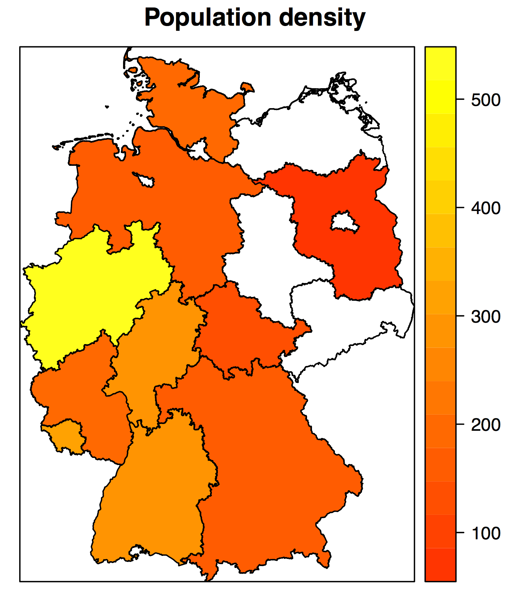

[](http://quantlet.de/)

## [](http://quantlet.de/) **SPL_CountiesDE_Descriptive_Statistics** [](http://quantlet.de/)

```yaml

Name of Quantlet: SPL_CountiesDE_Descriptive_Statistics

Published in: 'Statistical Programming Languages - Student Project on ''How attractive are German counties and county-level cities? A statistical analysis of various economic factors in terms of attractiveness and welfare'' '

Description: Performs first statistical analysis and plots state-averaged data

Keywords: descriptive statistics, plot, heat map, star plot, states

Author: Gerson Engel

See also: other Quantlets in this project

Submitted: 14.03.2017

Datafile: DEU_adm1.rds

Input: data.csv

Example: Descriptive_Statistics_1.png

```



### R Code
```r

# ====================================================== 
# =============== DESCRIPTIVE STATISTICS ===============
# ======================================================

dat = read.table("data.txt", header = TRUE, sep = "\t", dec = ",", na.strings = "NA", check.names = FALSE)
dat[, 4:13] = lapply(dat[, 4:13], function(x) as.numeric(as.character(x)))


# =============== MEAN, MAX, ST.DEV. ETC. ===============
library(stats)

Max      = apply(dat[, 4:10], MARGIN = 2, FUN = max)
Min      = apply(dat[, 4:10], MARGIN = 2, FUN = min)
Mean     = apply(dat[, 4:10], MARGIN = 2, FUN = mean)
St.Dev.  = apply(dat[, 4:10], MARGIN = 2, FUN = sd)
Quartile = t(apply(dat[, 4:10], MARGIN = 2, function(x) quantile(x, probs = c(0.25, 0.5, 0.75))))
colnames(Quartile) = c("Q1", "Median", "Q3")
tab      = round(data.frame(Min, Max, Mean, St.Dev., Quartile), digits = 2)
rm(Max, Min, Mean, St.Dev., Quartile)

    # ----- Latex-Output -----
    #install.packages("tables")
    #library(tables)
    #latex(tab, file = "")

    

# =============== BOX PLOTS FOR COUNTIES ===============
par(mfrow = c(4, 2), new = TRUE, oma = c(0, 0, 0, 0), mar = c(1, 2, 3, 1) + 0.1)
for (i in c(4:10)) {
    boxplot(dat[, i][which(dat$Category == "County")], dat[, i][which(dat$Category == "County-Level City")], border = c("darkgreen", "darkred"), main = colnames(dat)[i])
}
plot(dat$Category, main = "Frequency", col = c("darkgreen", "darkred"), font = 2)
text(x = 0.7, y = 50, labels = "Counties", cex = 1.5, col = "white", font = 2)
text(x = 1.9, y = 65, labels = "County-level", cex = 1.5, col = "white", font = 2)
text(x = 1.9, y = 30, labels = "Cities", cex = 1.5, col = "white", font = 2)


dev.off()


# =============== HEAT MAP OF GERMANY ===============
library(sp)
my.data = readRDS("DEU_adm1.rds")  # download from http://biogeo.ucdavis.edu/data/gadm2.8/rds/DEU_adm1.rds provides the polygons for Germany
my.data@data$NAME_1 = gsub("ü", "ue", my.data@data$NAME_1)  ### German 'ü' -> 'ue'


# preparing the average state data
states = my.data$NAME_1  # creating table using the order of my.data
av.data = data.frame(states, matrix(data = NA, nrow = 16, ncol = 7))
colnames(av.data) = colnames(dat)[c(1, 4:10)]

# population density
for (i in c(1:16)) {
    av.data[i, 2] = round(sum(dat[which(dat$Bundesland == states[i]), 11])/sum(dat[which(dat$Bundesland == states[i]), 11]/dat[which(dat$Bundesland == states[i]), 4]), 
        digits = 0)  # total population / total area
}
# GDP per inhabitant
for (i in c(1:16)) {
    av.data[i, 3] = round(sum(dat[which(dat$Bundesland == states[i]), 5] * dat[which(dat$Bundesland == states[i]), 11])/sum(dat[which(dat$Bundesland == states[i]), 
        11]), digits = 1)
}
# Workers in Agriculture
for (i in c(1:16)) {
    av.data[i, 4] = round(sum(dat[which(dat$Bundesland == states[i]), 6] * dat[which(dat$Bundesland == states[i]), 12])/sum(dat[which(dat$Bundesland == states[i]), 
        12]), digits = 2)
}
# GDP growth rate
for (i in c(1:16)) {
    av.data[i, 5] = round(sum(dat[which(dat$Bundesland == states[i]), 7] * dat[which(dat$Bundesland == states[i]), 13])/sum(dat[which(dat$Bundesland == states[i]), 
        13]), digits = 2)
}
# natality
for (i in c(1:16)) {
    av.data[i, 6] = round(sum(dat[which(dat$Bundesland == states[i]), 8] * dat[which(dat$Bundesland == states[i]), 11])/sum(dat[which(dat$Bundesland == states[i]), 
        11]), digits = 2)
}
# Migration (%)
for (i in c(1:16)) {
    av.data[i, 7] = round(100 * sum(dat[which(dat$Bundesland == states[i]), 9] * dat[which(dat$Bundesland == states[i]), 4])/sum(dat[which(dat$Bundesland == states[i]), 
        11]), digits = 3)
}
colnames(av.data)[7] = "Migration"
# unemployment
for (i in c(1:16)) {
    av.data[i, 8] = round(sum(dat[which(dat$Bundesland == states[i]), 10] * dat[which(dat$Bundesland == states[i]), 12])/sum(dat[which(dat$Bundesland == states[i]), 
        12]), digits = 2)
}
rm(i, states)
# Sachsen [14], Sachsen-Anhalt [13] and Mecklenburg-Vorpommern [8] have too many NAs, Berlin [3] and Hamburg [6] are missing at all. The problem with Bremen is, that
# its population density is a strong outlier.
av.data[c(3, 5, 6, 8, 13, 14), 2:8] = NA

# Putting our variable data into the data frame in the correct order
my.data@data = data.frame(my.data@data, av.data[match(my.data@data[, "NAME_1"], av.data[, "Name"]), ])
View(my.data@data)

# Check (prints out a variable, ordered)
my.data@data[order(-my.data$Migration), c("NAME_1", "Migration")]

# Copying the variables to the right place in the data.frame for spplot
my.data$Migration = my.data@data$Migration

spplot(my.data, zcol = "Migration", main = "Net Migration (% per year)", col.regions = heat.colors(50)[10:40])
# alternative main with unit: main = expression(paste('Population density in ', km^{-2}))


# =============== STAR PLOTS ===============
star.dat = av.data[complete.cases(av.data), c(1, 2, 4, 8, 7, 6, 3, 5)]  # data selection, now rescaling:
dmin     = c(0, 0, 0, -0.07, 0, 0, 0)
dmax     = apply(star.dat[, -1], 2, max)
s.star.dat = scale(star.dat[, -1], center = dmin, scale = dmax - dmin)
states   = as.vector(star.dat[, 1])
col      = c("black", "green", "red", "yellow", "grey", "blue", "turquoise")
stars(s.star.dat[, ], scale = F, ncol = 4, nrow = 3, draw.segments = T, col.segments = col, labels = states, flip.labels = F, key.loc = c(8.3, 1.7), key.labels = colnames(s.star.dat), 
    lty = 1, lwd = 1.5, cex = 1, len = 1)
rm(dmin, dmax, states, star.dat, s.star.dat, col)  # Cleaning up

```

automatically created on 2018-05-28