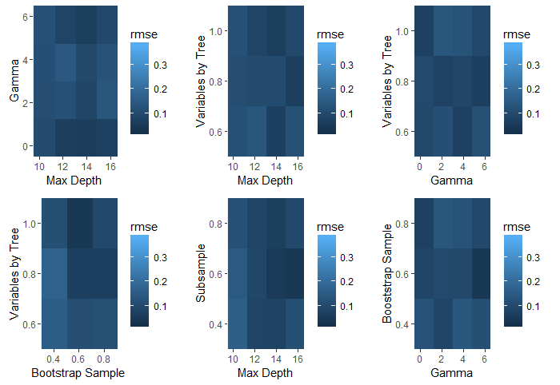
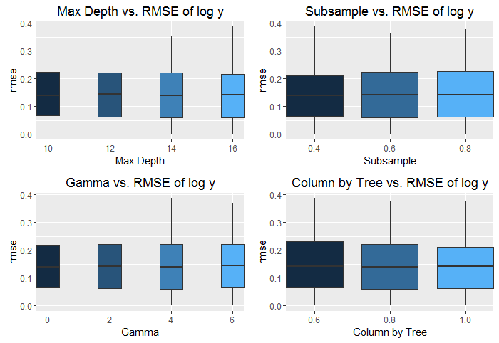

[](http://quantlet.de/)

## [](http://quantlet.de/) **SPL_HousePriceML_xgbTuning** [](http://quantlet.de/)

```yaml

Name of Quantlet: SPL_HousePriceML_xgbTuning
Published in:  'Statistic Programming Language - Student Project on ''Predicting House Prices using Machine Learning Techniques'' '

Description: 'Tune parameters of the xgboost model using cross validation. The optimal parameter will be used to foreast house price.'
Keywords: xgboosting, cross-validation, cv, plot, error, model, parameter
Author: Dennis Koehn
Submitted: Sun, January 8, 2016 by Mingyang Li
Datafile: basic_processing.RData


```





### R Code
```r

############ Stochastic Gradient Boosting training using package 'xgboost' #############

### setwd('F:/PHD/IRTG/courses/SPL/Quantlet/xgb_tuning')
rm(list = ls())
graphics.off()

libraries = c("caret", "xgboost", "Matrix", "ggplot2", "Rmisc")
lapply(libraries, function(x) if (!(x %in% installed.packages())) {
    install.packages(x)
})
lapply(libraries, library, quietly = TRUE, character.only = TRUE)
source("performanceMetrics.R")  # to get performance metrics 
source("visulizations.R")

load("basic_processing.RData")

# get preprocessed data
train = basic_data$traint
test = basic_data$test
y = train$y
train$y = NULL
X_com = rbind(train, test)

# save result path (change according to experiment here: input date is from quick
# preprocessing function)
result_path = "output/xgb_basic"

########## perform repeated nested cv set cv parameter
repetitions = 5  # repetitions of cv 
k_folds = 5  # folds in the cv loop

# create Grid for GridSearch to tune hyperparameter Tree specific Parameters: maxnodes:
# longest path of a single tree (decreased performance) colsample_bytree: variable considered
# at each split subsample: size of the bagging bootstrap sample

nrounds_fixed = 1000  # number of trees: no need for tuning since early.stopping is possible 
eta_fixed = 0.025  # learning rate (fixed for now)
treeSpecificGrid = expand.grid(max_depth = seq(10, 16, 2), gamma = seq(0, 6, 2), subsample = seq(0.4, 
    0.8, 0.2), colsample_bytree = seq(0.6, 1, 0.2))
# samplesize could be inspected as well
numOfParameter = ncol(treeSpecificGrid)
# create a matrix to with the GridSearch parameters and their RMSE
parameter_names = c("max_depth", "gamma", "subsample", "colsample_bytree")
# set up empty matrices to be filled with rmse and best_paramer (here only lambda)


### start nested repeated nested cv loop Repetition outer loop create empty vector/matrix to
### save best results
parameters = matrix(0, nrow = nrow(treeSpecificGrid), ncol = numOfParameter + 1)
colnames(parameters) = c("rmse", parameter_names)
result_list = lapply(seq_len(repetitions), function(X) parameters)

# start repetition loop
for (t in 1:repetitions) {
    # draw random integers for the k-folds
    folds = sample(rep(1:k_folds, length.out = nrow(train)))
    # create empty vector/matrix to save best results
    tuning_results = cbind(rep(0, nrow(treeSpecificGrid)), treeSpecificGrid)
    colnames(tuning_results) = c("rmse", parameter_names)
    # start crossvalidation loop
    for (k in 1:k_folds) {
        # split into training and validation set
        indexValidation = which(folds == k)
        training = train[-indexValidation, ]
        y_training = y[-indexValidation]
        validation = train[indexValidation, ]
        y_validation = y[indexValidation]
        
        # convert for data into a format xgb.train can handle
        dtrain = xgb.DMatrix(data = as.matrix(training), label = y_training)
        dvalidation = xgb.DMatrix(data = as.matrix(validation), label = y_validation)
        watchlist = list(eval = dvalidation, train = dtrain)
        # start GridSearch loop
        for (i in 1:nrow(treeSpecificGrid)) {
            # determine arbitrary xgboost parameters in a list
            xgb_paramters = list(eta = eta_fixed, max.depth = treeSpecificGrid$max_depth[i], gamma = treeSpecificGrid$gamma[i], 
                colsample_bytree = treeSpecificGrid$colsample_bytree[i], subsample = treeSpecificGrid$subsample[i], 
                eval_metric = "rmse", maximize = FALSE)
            # fit the xgboost
            xgbFit = xgb.train(params = xgb_paramters, data = dtrain, booster = "gbtree", nround = nrounds_fixed, 
                verbose = 1, early.stop.round = 50, objective = "reg:linear", watchlist = watchlist)
            # predict SalePrice
            yhat = predict(xgbFit, newdata = dvalidation)
            # fill the first column of this matrix with the rmse results (of the log outputs)
            validation_error = rmse_log(y_validation, yhat)
            tuning_results[i, 1] = validation_error
            # save all training results as csv file (fold_k_reptetion_t)
            write.csv(tuning_results, file = paste(result_path, t, k, ".csv", sep = "_"))
        }
    }
    result_list[[t]] = tuning_results
}
# print result list
print(result_list)

### read the results and do the plots
load_data = function(wd = "output/") {
    setwd(wd)
    files = list.files()
    tables = lapply(files, read.csv)
    df = do.call(rbind, tables)
    return(df)
}
results = load_data()

# plot result per parameter
max_depth = box_hyperparameter(results, results$max_depth, "Max Depth")
gamma = box_hyperparameter(results, results$gamma, "Gamma")
subsample = box_hyperparameter(results, results$subsample, "Subsample")
colbytree = box_hyperparameter(results, results$colsample_bytree, "Column by Tree")
multiplot(max_depth, gamma, subsample, colbytree, cols = 2)

p1 = hyperparameter_heatmap(results, results$max_depth, results$gamma, "Max Depth", "Gamma")
p2 = hyperparameter_heatmap(results, results$subsample, results$colsample_bytree, "Bootstrap Sample", 
    "Variables by Tree")
p3 = hyperparameter_heatmap(results, results$max_depth, results$colsample_bytree, "Max Depth", 
    "Variables by Tree")
p4 = hyperparameter_heatmap(results, results$max_depth, results$subsample, "Max Depth", "Subsample")
p5 = hyperparameter_heatmap(results, results$gamma, results$colsample_bytree, "Gamma", "Variables by Tree")
p6 = hyperparameter_heatmap(results, results$gamma, results$subsample, "Gamma", "Booststrap Sample")
multiplot(p1, p2, p3, p4, p5, p6, cols = 3)

```

automatically created on 2018-05-28